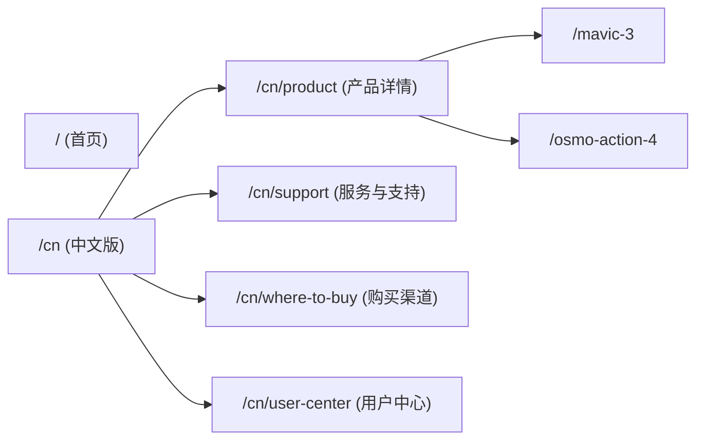

# DJI 官网核心架构图 (Clone 方案)

本架构图基于对 `https://www.dji.com/cn` 的分析，旨在指导使用现代技术栈 (Next.js + React) 进行克隆。

## 1. 系统架构概览

采用 **Next.js (App Router)** 作为核心框架，利用其 SSR (服务端渲染) 能力满足 SEO 需求，结合 **Tailwind CSS** 进行样式开发，**Framer Motion** 实现复杂的交互动画。

```mermaid
graph TD
    User[用户] --> CDN[CDN / Edge]
    CDN --> NextJS[Next.js Server]
    
    subgraph "前端层 (Client)"
        Layout[全局布局 Layout]
        Navbar[导航栏 Navbar]
        Footer[页脚 Footer]
        Page[页面 Page]
        
        Layout --> Navbar
        Layout --> Page
        Layout --> Footer
        
        Page --> Hero[Hero 轮播图]
        Page --> ProductGrid[产品网格]
        Page --> Innovation[创新故事]
        Page --> AppDownload[App 下载]
    end
    
    subgraph "数据层 (Data)"
        StaticData[静态配置 (JSON)]
        API[API 接口]
    end
    
    NextJS --> StaticData
    NextJS --> API
```

## 2. 路由结构 (Routes)

DJI 官网采用多级路由结构，克隆版建议使用 Next.js 的文件系统路由。



## 3. 核心组件拆解 (Component Hierarchy)

### 3.1 导航栏 (Navbar)
*   **Logo**: 品牌标识。
*   **NavMenu**: 多级下拉菜单 (Desktop: Hover 触发; Mobile: 点击展开)。
    *   *Props*: `items` (菜单数据结构)。
*   **NavActions**: 搜索、用户中心、购物车、语言切换。

### 3.2 首页 (Home Page)
*   **HeroSlider**: 全屏轮播图。
    *   *Tech*: Swiper.js 或 Framer Motion。
    *   *Features*: 图片/视频背景，文字动画，进度条指示器。
*   **ProductShowcase**: 产品展示卡片。
    *   *Layout*: Grid 布局 (响应式)。
    *   *Content*: 图片, 标题, 副标题, "了解更多", "立即购买"。
*   **StorySection**: 图文混排，展示新闻或获奖信息。

## 4. 状态管理 (State Management)

使用 **Zustand** 或 **React Context** 管理全局状态。

*   **GlobalState**:
    *   `region`: 当前地区 (cn, en, etc.)。
    *   `theme`: 明/暗色模式 (如有)。
    *   `isMobileMenuOpen`: 移动端菜单开关。
*   **LocalState**:
    *   `currentSlide`: 轮播图当前索引。
    *   `hoveredNavItem`: 导航栏当前激活项。

## 5. 样式与交互 (Styles & Interactions)

*   **Tailwind CSS**: 原子化 CSS，快速构建响应式布局。
    *   *Breakpoints*: `sm`, `md`, `lg`, `xl`, `2xl` (适配 Mobile, Tablet, Desktop)。
*   **Animations**:
    *   *Navbar*: 下拉菜单的淡入淡出 (Fade In/Out)。
    *   *Hero*: 文字的上浮出现 (Slide Up + Fade In)。
    *   *Scroll*: 滚动时的元素视差或渐显效果。

## 6. 数据模型示例 (TypeScript Interfaces)

```typescript
interface NavItem {
  label: string;
  link?: string;
  children?: NavItem[]; // 下级菜单
  thumbnail?: string;   // 菜单中的预览图
}

interface Product {
  id: string;
  name: string;
  tagline: string;
  coverImage: string;
  learnMoreLink: string;
  buyLink: string;
}
```
